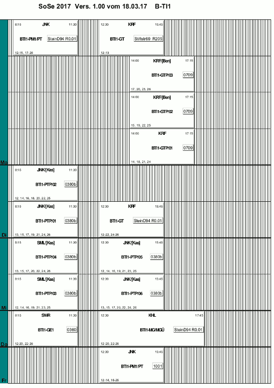
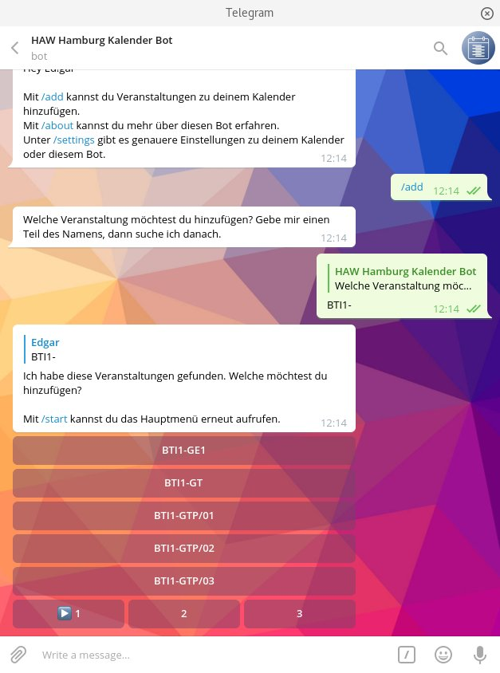

Du kommst von der HAW Hamburg und studierst im Department Informatik oder Elektrotechnik?
Dieser Veranstaltungsplan kommt dir bekannt vor und er ist dir zu unübersichtlich?
Zu viele Veranstaltungen die du nicht belegst? Du bist in mehreren Semestern und musst mehrere Pläne angucken?



Vielleicht hilft dir ja mein [Telegram Kalender Bot @HAWHHCalendarBot](https://telegram.me/HAWHHCalendarBot).

## Der Telegram Bot

Wenn du [Telegram](https://telegram.org) benutzt, dann sind dir sicher schon einmal die Bots aufgefallen.
Mithilfe so eines Telegram Bots kannst du dir deine Veranstaltungen zusammenstellen.
Damit wird dann automatisch ein abonnierbarer Kalender für dich erstellt.
Diesen kannst du dann in jedem guten Kalenderprogramm hinzufügen.

Hier geht es zum [Telegram Bot @HAWHHCalendarBot](https://telegram.me/HAWHHCalendarBot).



## Behind the Scenes

### Der Telegram Bot

Wenn du den Telegram Bot benutzt, legt dieser eine Config Datei an.
In dieser stehen Informationen wie deine öffentlichen Telegram Informationen, die der Bot aber erst erhält, sobald du ihn das erste Mal anschreibst.
Fügst du Veranstaltungen hinzu oder entfernst diese, werden sie in die Config Datei übertragen.
Außerdem speichert der Bot deine Einstellungen, wie zur Mensa.

Der Inhalt einer Config Datei:

```json
{
  "chat": {
    "id": 2956631,
    "first_name": "Edgar",
    "username": "EdJoPaTo"
  },
  "config": {
    "changes": [],
    "events": {
      "MINF-SS-MD [MT]": {},
      "MINF-SS-MDP/03 [MTP]": {},
      "MINF-SS-TTI [TT2]": {},
      "MINF-SS-TTIP/03 (TTP2)": {},
      "MINF1-GSM [AW1 AW2]": {}
    },
    "mensa": {
      "main": "Mensa Berliner Tor",
      "price": "student"
    }
  }
}
```

### Das Backend

Im Hintergrund läuft auf einem vServer das Backend.
Dieses tut im Wesentlichen zwei Dinge:
Die aktuellen ICS Dateien vom HAW-Server laden und aus den Veranstaltungskalendern und den Config Dateien die Kalender generieren.
Diese aus den Configs der Nutzer generierten Kalender werden dann zum Abonnieren bereitgestellt.

### Dein Endgerät

Je nachdem wie dein Endgerät eingestellt ist, wird es die ICS Datei von meinem Server alle paar Stunden laden.
Apple Geräte wie iOS oder macOS laden als häufigste Einstellmöglichkeit alle 15 Minuten eine neue Version.
Google macht das etwas anders: Ein Google Server lädt alle paar Stunden (teilweise auch >24h) alle bei Google eingetragenen Kalender von meinem Server.
Die Android-Geräte bekommen dann, wenn sich etwas geändert hat, diese Änderung sofort auf das Gerät gepusht.

### Das StISys Update

Alle paar Minuten werden Webseiten wie [StISys](https://stisys.haw-hamburg.de) betrachtet und verglichen.
Unterscheidet sich diese, wird dies im [Telegram Kanal @HAWHHWebsiteStalker](https://telegram.me/HAWHHWebsiteStalker) und über das [GitHub Repo study-website-stalker](https://github.com/HAWHHCalendarBot/study-website-stalker) verfügbar gemacht und kann abonniert werden.

### GitHub

Neugierig auf den Quellcode des Telegram Bots?
Du willst Helfen oder etwas Ähnliches entwickeln?
Dann schau dir gern mal den Quellcode auf [GitHub](https://github.com/HAWHHCalendarBot) an.

## Fehler oder Verbesserungsvorschlag?

Schreib mich einfach bei Telegram an: [@EdJoPaTo](https://telegram.me/EdJoPaTo) oder erstelle ein Issue im dazu passenden Repo in der [GitHub Organisation des Kalender-Bots](https://github.com/HAWHHCalendarBot).
